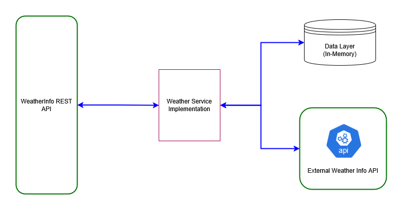

# WeatherInfoService Docs

## Assumptions

1. This is a service created only to retrieve weather information (updating or adding weather information is not supported as the requirement stated is to "provides current weather data for different cities (upto 3)")

## How to Build

## How to invoke the service

### Documentation for Authorization

Endpoints do not require authorization.

### Documentation for API Endpoints

All URIs are relative to the server url in which the service is deployed.
i.e. Local Tomcat Server: *http://localhost:8080*

 Method | HTTP request | Description
| ------------- | ------------- | -------------
[**weatherCurrentCityGet**](docs/DefaultApi.md#weatherCurrentCityGet) | **GET** /weather/current/city | Get current weather by city
[**weatherCurrentCityTemperatureGet**](docs/DefaultApi.md#weatherCurrentCityTemperatureGet) | **GET** /weather/current/city/temperature | Get temperature by city
[**weatherCurrentCoordinateGet**](docs/DefaultApi.md#weatherCurrentCoordinateGet) | **GET** /weather/current/coordinate | Get current weather by coordinates
[**weatherForecastCityGet**](docs/DefaultApi.md#weatherForecastCityGet) | **GET** /weather/forecast/city | Get weather forecast by city and date

